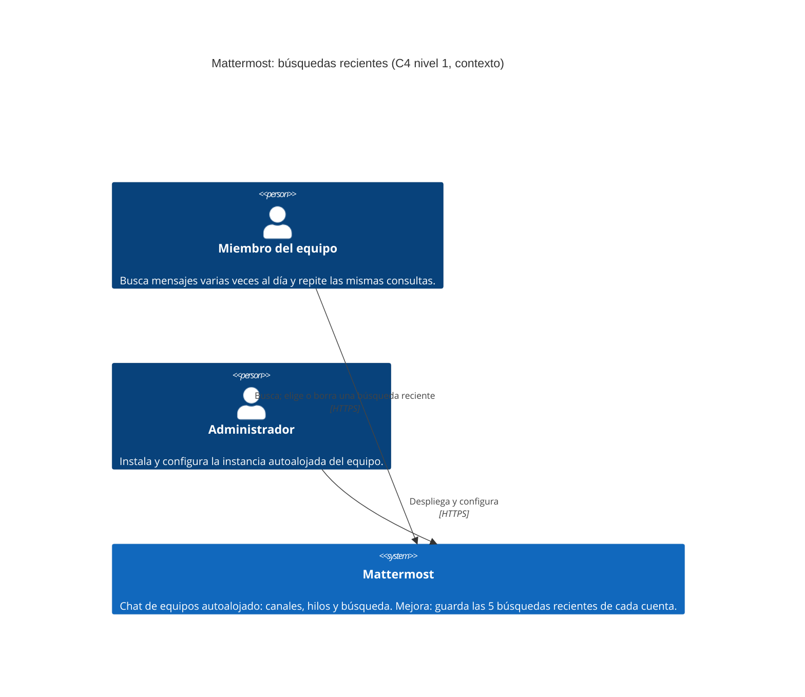

# Diagrama C4 · Nivel 1 (contexto)

Proyecto del equipo Foo sobre Mattermost: búsquedas recientes en el cuadro de búsqueda ([issue #15976](https://github.com/mattermost/mattermost/issues/15976)).

En este nivel solo se muestra el sistema y quién se relaciona con él. La lista de búsquedas recientes no es un sistema aparte: es un dato de cada cuenta dentro de Mattermost, por eso no aparecen sistemas externos nuevos.

## Elementos

| Elemento | Tipo | Descripción |
|---|---|---|
| Miembro del equipo | Persona | Usuario meta. Consulta el historial de los canales varias veces al día y repite búsquedas (un incidente, un nombre, un archivo). |
| Administrador | Persona | Despliega y configura la instancia. No interviene en la mejora. |
| Mattermost | Sistema de software | Servidor en Go y aplicación web en React/TypeScript. Con la mejora, guarda hasta cinco búsquedas recientes por cuenta y las muestra al abrir el cuadro de búsqueda. |

## Relaciones

| Origen | Destino | Descripción | Tecnología |
|---|---|---|---|
| Miembro del equipo | Mattermost | Busca mensajes; elige una búsqueda reciente para volver a lanzarla o la borra. | HTTPS, navegador web |
| Administrador | Mattermost | Despliega y configura la instancia. | HTTPS, consola del sistema |

## Decisiones reflejadas en el diagrama

- **Sin sistemas externos nuevos.** La lista se guarda como preferencia del usuario con la API existente de Mattermost (`/api/v4/users/{id}/preferences`), el mismo patrón que ya usan los estados personalizados recientes. No se usa la tabla `recentsearches`, que el propio código marca como sin uso y pendiente de eliminarse.
- **Solo la aplicación web.** La aplicación móvil queda fuera del alcance.
- **Nivel 2 pendiente.** Cómo se reparten la lista el servidor y la aplicación web corresponde al diagrama de contenedores, en una entrega posterior.

[Volver al README](../../README.md#diagrama-de-arquitectura-c4)
